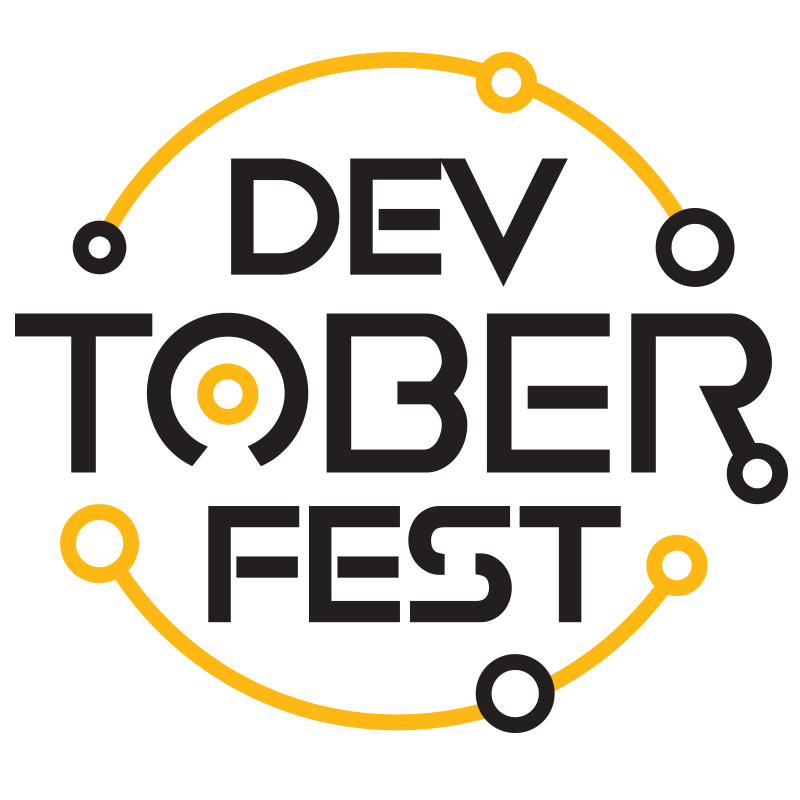

# Devtoberfest 2021 from SAP

## Description

Devtoberfest might be over, but the fun and learning is just starting. We hope that everyone joins this week for [SAP TechEd 2021](https://reg.sapevents.sap.com/flow/sap/sapteched2021/portal/page/overview).  Also all of the content from Devtoberfest remains available for replay.  We will be performing the final points calculations on November 13th and 14th and then announcing the overall winner during the closing hour of SAP TechEd 2021. See you all there!

Devtoberfest is a 6-week event, leading up to SAP TechEd. This event is to be seen as a celebration of and for Developers. Every developer is welcome to join 6 weeks of tech talks, guest speakers, community contribution through a gamified learning journey with prizes, and celebratory events.

Read more about the event in [the kick-off blog post](https://blogs.sap.com/2021/09/07/devtoberfest-2021-the-developer-strikes-back/)

**Registration:** [Devtoberfest Eventbite Registration Page](https://www.eventbrite.com/e/168612930815)

**Discord:** [Devtoberfest Gaming Night Server](https://discord.gg/8EDCdsYe7p)

Register for the event on Eventbrite to recieve all the latest notifications about Devtoberfest. Registration is also required to be entered in the [Contest](#contest-the-game) aspects of Devtoberfest.

A list of all submitted open source projects to be part of Devtoberfest with details can be found in [entries.md](./contest/entries.md). Be sure to support these great community projects and take advantage of what they are sharing with everyone.

## Key Dates

| Current Week | Date | Description |
| ---------------- | ---------------- | ---------------- |
| | Oct 1 | Devtoberfest Begins! |
| | Oct 4 - 8 | [Week 1 - Welcome to Devtoberfest](topics/Week1_Welcome/README.md) |
| | Oct 11 - 15 | [Week 2 - Best Practices](topics/Week2_Best_Practices/README.md) |
| | Oct 15 | [Dogtoberfest Day](topics/Dogtoberfest/README.md) |
| | Oct 18 - 22 | [Week 3 - Cloud Native](topics/Week3_Cloud_Native/README.md) |
| | Oct 25 - 29 | [Week 4 - Security](topics/Week4_Security/README.md) |
| | Nov 1 - 5 | [Week 5 - Data && Analytics](topics/Week5_Data/README.md) |
| | Nov 8 - 12 | [Week 6 - Frontend](topics/Week6_Frontend/README.md) |
| | Nov 12 | Devtoberfest Ends |
| Current Week | Nov 16 | [TechEd Begins](https://reg.sapevents.sap.com/flow/sap/sapteched2021/overview/page/content)

## Contest (The Game)

A game that is open to all developers.  Points can be accrued by completing items listed on [the game page readme](contest/readme.md).  Points are awarded for things such as attending a presentation or completing tutorials on SAP Community. Prizes are awarded based on badges earned and associated points accumulated.  Prize and Points are described on [the game page readme](contest/readme.md) as well as the rules relating to how many winners will make it to the Grand Prize Winner drawing.

For full details on the contest aspects please see the [Game Page Readme](contest/readme.md) and of course for all the rules see [Terms and Conditions](TOC.md).

But the fun doesn’t end there.  We have an animated Contest Gameboard to help you track your progress through the contest.  Just replace `scnId.Here` with your SAP Community Profile ID to the end of the following URL: [https://devrel-tools-prod-scn-badges-srv.cfapps.eu10.hana.ondemand.com/devtoberfestContest/scnId.Here](https://devrel-tools-prod-scn-badges-srv.cfapps.eu10.hana.ondemand.com/devtoberfestContest/scnId.Here).

And if you are curious how we built the animated gameboard, we have also released the whole thing as a Sample Code repository here: [https://github.com/SAP-samples/sap-community-activity-badges](https://github.com/SAP-samples/sap-community-activity-badges)

## Contributing to Open Source

If you want to earn additional points towards the Devtoberfest contest, you can submit your own Open Source project or make a meaningful contribution to the [Open Documentation Initiative](http://sap.to/6057JKV2V). Being involved in the SAP Community is important to us, that is why we would love to see your contributions.

## Coding Challenges

Coding Challenges are a fun way to recap and cement the learnings made during Devtoberfest. Each week you can face a new challenge and earn points for the Devtoberfest Contest. Close before the end of a week, the Coding Challenge for the coming week gets introduced on the respective topic page.

## All Work and No Play? Nope!

As part of the entire Devetoberfest celebration we want to take time to have some fun and relax with topics outside the normal work day. Therefore we will have special sessions each Friday during Devetobefest specifically for fun in mind. Check the topic agenda pages of each week for more details.

## How to obtain support

[Create an issue](https://github.com/SAP-samples/devtoberfest-2021/issues) in this repository if you find a bug or have questions about the content.

For additional support, [ask a question in SAP Community](https://answers.sap.com/questions/ask.html).

## Legal Stuff

The legal terms and conditions of for this event are detailed in the [TOC](TOC.md).

## License
Copyright (c) 2021 SAP SE or an SAP affiliate company. All rights reserved. This project is licensed under the Apache Software License, version 2.0 except as noted otherwise in the [LICENSE](LICENSES/Apache-2.0.txt) file.
