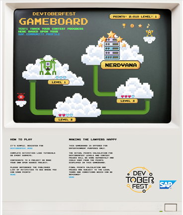

## Devtoberfest Contest – The Game
For Devtoberfest 2021 we have a game that is open to everyone regardless of developer level.  Points can be accrued by completing items listed below that range from attending a presentation to completing tutorials on SAP Community. Prizes are awarded based on badges earned and associated points accumulated.  Prize and Points are described below as well as the rules relating to how many winners will make it to the Grand Prize Winner drawing.

## Game Board – A Place to check your game level status.
[The Game Board](https://devrel-tools-prod-scn-badges-srv.cfapps.eu10.hana.ondemand.com/devtoberfestContest/) is a static infographic that you can use to see your status.  

Once registered for Devotberfest 2021 you will also earn your first badge, Devtoberfest 2021 on your [SAP Community ID](https://people.sap.com/).

## Points – Awarded and accumulated against your SAP Community ID.
This table includes a sample of some events that you can earn a badge with points associated.  Once that badge is applied to your SAP Community ID you will be able to see your points status change on [the Devtoberfest Gameboard](https://devrel-tools-prod-scn-badges-srv.cfapps.eu10.hana.ondemand.com/devtoberfestContest/).  More events will be published in future weeks of Devtoberfest, including a list after week 3 of a special group of 20 tutorials (Scavenger Hunt) as a Devtoberfest Mission with bonus points awarded if all 20 tutorials completed.

| Activity	| Points Awarded |
|---|---|
| [Register](https://www.eventbrite.com/e/168612930815)	| 10 |
|[Contribute to the Open Documentation Initiative](https://blogs.sap.com/2021/05/20/introducing-the-open-documentation-initiative/) |	500 |
|[Scavenger Hunt of 20 Tutorials](https://developers.sap.com/mission.devtoberfest-scavenger-hunt.html) |	Up to 10600 |
|Tutorials in each content week	| 200 |
|Attend Live Youtube Speaker Session and complete validation | 300 |
|[Submit Project to Devtoberfest 2021 on GitHub](opensource.md)	| 1000 |
| | |

We will have many existing tutorials from https://developers.sap.com that you can complete to earn points in Devtoberfest 2021. Each week we will announce the tutorials that go along with the topic of the week which you can complete for points. However we didn't want to penalize those of you that might have already completed these tutorials in the past. Therefore if you are registered for Devtoberfest and completed these key tutorials in the past you are granted credit automatically for those.

## Prize Levels – What you can win!
Prizes are awarded via points accumulated and you can see the potential prize pool and associated points required below.  If you win a higher level (3 Stars, you will receive all prizes in lower levels as well (1 and 2 Stars):

| Level	| Points Required	| Prizes*	| Badges awarded |
|---|---|---|---|
|Registrant	| 10	| Devtoberfest 2021 | 	| Devtoberfest 2021 |
|1 Star	| 2000	| Devtoberfest 2021 T-Shirt and stickers |	 |
|2 Stars | 12000 | $100 Voucher and Virtual Selfie with Advocate |	 |
|3 Stars | 18000| Devtoberfest 2021 Outerwear  (jacket/fleece) |  |
|4 Stars (Grand Prize) 1 Winner	| 24000 |	Donation to Charity and Trees Planted in winners name |  |

## Game Specific Rules
* You must complete the items described in the point activity grid to receive prizes
* SAP will count the points by verifying your participation badges
* Once we have distributed our prizes out for levels 1-3 there will be no more prizes available.
* One grand prize winner (4 Stars) will be given even if more than one person achieves the total points needed for 4 stars.  All 4 star qualifiers will have their name written on a piece of paper and placed in a bowl. Then SAP will have someone draw a name from that bowl on a recorded video camera segment.
* See the [legal terms and conditions](../TOC.md) for full details

## How to Enter
It’s simple.  Register for the Devtoberfest Game.  Complete activities like tutorials or event surveys in any of the 6 weeks of Devtoberfest Oct 1, 2021 thru November 12, 2021.  [Contribute to a project or make your own open source project](opensource.md).  Please reference the published list below of activities to see where you can earn points.  Check back every week as more activities added.  

## Points Earning Activities by Week

### Week 1

|Activity | Points Earned | Badge |
|---|---|----|
| [Register with eventbrite](https://www.eventbrite.com/e/168612930815)	 |	10 |  |
| [Contribute to the Open Documentation Initiative](https://blogs.sap.com/2021/05/20/introducing-the-open-documentation-initiative/) |	500 |  |
| [Submit project to Devtoberfest GitHub](opensource.md)	| 1000 | 
| [Attend Devtoberfest Kickoff Party](https://developers.sap.com/tutorials/devtoberfest-week-1-speaker.html) | 50 | 
| [Attend Week 1 Fun Friday Event](https://developers.sap.com/tutorials/devtoberfest-week-1-fun-friday.html) |	300 | 

### Week 2

|Activity | Points Earned | Badge |
|---|---|----|
| [Attend Week 2 Speaker Event](https://developers.sap.com/tutorials/devtoberfest-week-2-speaker.html) | 100 | 
| [Create a User Interface with CAP (SAP HANA Cloud)](https://developers.sap.com/tutorials/hana-cloud-cap-create-ui.html) | 200 | 
| [Add User Authentication to Your Application (SAP HANA Cloud)](https://developers.sap.com/tutorials/hana-cloud-cap-add-authentication.html ) | 200 | 
| [Introduction to Application Development Using CAP and Node.js](https://developers.sap.com/tutorials/btp-app-introduction.html) | 200 | 
| [Set Up Local Development Using VS Code](https://developers.sap.com/tutorials/btp-app-set-up-local-development.html) | 200 | 
| [Create a Directory for Development](https://developers.sap.com/tutorials/btp-app-create-directory.html) | 200 | 
| [Create a CAP-Based Application](https://developers.sap.com/tutorials/btp-app-create-cap-application.html) | 200 | 
| [Create an SAP Fiori Elements-Based UI](https://developers.sap.com/tutorials/btp-app-create-ui-fiori-elements.html) | 200 | 
| [Add Business Logic to Your Application](https://developers.sap.com/tutorials/btp-app-cap-business-logic.html) | 200 | 
| [Create a UI Using Freestyle SAPUI5](https://developers.sap.com/tutorials/btp-app-create-ui-freestyle-sapui5.html) | 200 | 
| [Add More Than One Application to the Launch Page](https://developers.sap.com/tutorials/btp-app-launchpage.html) | 200 | 
| [Implement Roles and Authorization Checks In CAP](https://developers.sap.com/tutorials/btp-app-cap-roles.html) | 200 | 
| [Prepare for SAP BTP Development](https://developers.sap.com/tutorials/btp-app-prepare-btp.html) | 200 | 
| [Set Up the SAP HANA Cloud Service](https://developers.sap.com/tutorials/btp-app-hana-cloud-setup.html) | 200 | 
| [Prepare User Authentication and Authorization (XSUAA) Setup](https://developers.sap.com/tutorials/btp-app-prepare-xsuaa.html) | 200 | 
| [Deploy Your Multi-Target Application (MTA)](https://developers.sap.com/tutorials/btp-app-cap-mta-deployment.html) | 200 | 
| [Add the SAP Launchpad Service](https://developers.sap.com/tutorials/btp-app-launchpad-service.html) | 200 | 
| [Assign a Role Collection to a User](https://developers.sap.com/tutorials/btp-app-role-assignment.html) | 200 | 
| [Enable Logging Service for Your Application](https://developers.sap.com/tutorials/btp-app-logging.html) | 200 | 
| [Undeploy Your Multi-Target Application (MTA)](https://developers.sap.com/tutorials/btp-app-undeploy-cap-application.html) | 200 | 
| [Configure and Run a Predefined SAP Continuous Integration and Delivery (CI/CD) Pipeline](https://developers.sap.com/tutorials/btp-app-ci-cd-btp.html) | 200 | 
| [Create Table Persistence and Generate Data](https://developers.sap.com/tutorials/abap-environment-persistence.html) | 200 | 
| [Define and Expose a CDS-Based Travel Data Model](https://developers.sap.com/tutorials/abap-environment-data-model.html) | 200 | 
| [Create Behavior Definition for Managed Scenario](https://developers.sap.com/tutorials/abap-environment-behavior.html) | 200 | 
| [Enhance Behavior With Action and Validation](https://developers.sap.com/tutorials/abap-environment-behavior-action.html) | 200 | 
| [Best Practices Coding Challenge](https://github.com/SAP-samples/devtoberfest-2021/blob/main/topics/Week2_Best_Practices/challenge) | 500 | 
| [Attend Week 2 Fun Friday Event](https://developers.sap.com/tutorials/devtoberfest-week-2-fun-friday.html) |	300 | 
| [Participate in Dogtoberfest](https://developers.sap.com/tutorials/devtoberfest-dogtoberfest.html) | 100 | 

### Week 3

|Activity | Points Earned | Badge |
|---|---|----|
| [Attend Week 3 Speaker Event](https://developers.sap.com/tutorials/devtoberfest-week-3-speaker.html) | 100 | 
| [Trigger a Microservice with an Event](https://developers.sap.com/tutorials/cp-kyma-microservice-trigger.html) | 200 | 
| [Install the Kubernetes Command Line Tool](https://developers.sap.com/tutorials/cp-kyma-download-cli.html) | 200 | 
| [Deploy MSSQL in the Kyma Runtime](https://developers.sap.com/tutorials/cp-kyma-mssql-deployment.html) | 200 | 
| [Deploy a Go MSSQL API Endpoint in the Kyma Runtime](https://developers.sap.com/tutorials/cp-kyma-api-mssql-golang.html) | 200 | 
| [Deploy the SAPUI5 Frontend in the Kyma Runtime](https://developers.sap.com/tutorials/cp-kyma-frontend-ui5-mssql.html) | 200 | 
| [Deploy Commerce Mock Application in the Kyma Runtime](https://developers.sap.com/tutorials/cp-kyma-mocks.html) | 200 | 
| [Using Kyma Extensions Help Documentation](https://help.sap.com/viewer/8438f051ded544d2ba1303e67fc5ff86/PROD/en-US/8722f8e5157b4cf9be5f0177906a0351.html) -  [Validation Tutorial Here](https://developers.sap.com/tutorials/devtoberfest-week-3-kyma.html) | 200 | 
| [Week 3 Fun Friday Attendee](https://developers.sap.com/tutorials/devtoberfest-week-3-fun-friday.html) | 200 | 

### Scavenger Hunt

|Activity | Points Earned | Badge |
|---|---|----|
| [View the SAP BTP from 10,000 Meters](https://developers.sap.com/tutorials/cp-explore-cloud-platform.html) | 200 | 
| [Get a Free Account on SAP BTP Trial](https://developers.sap.com/tutorials/hcp-create-trial-account.html) | 200 | 
| [Take a Tour of SAP BTP Trial](https://developers.sap.com/tutorials/cp-trial-quick-onboarding.html) | 200 | 
| [Add a New Entitlement to Your Subaccount](https://developers.sap.com/tutorials/cp-cf-entitlements-add.html) | 200 | 
| [Get Started with the SAP BTP Command Line Interface (btp CLI)](https://developers.sap.com/tutorials/cp-sapcp-getstarted.html) | 200 | 
| [Create a User Interface with CAP (SAP HANA Cloud)](https://developers.sap.com/tutorials/hana-cloud-cap-create-ui.html) | 200 | 
| [Add More Than One Application to the Launch Page](https://developers.sap.com/tutorials/btp-app-launchpage.html) | 200 | 
| [Setup of SAP Mesh via Kyma Help Documentation](https://help.sap.com/viewer/65de2977205c403bbc107264b8eccf4b/Cloud/en-US/407d1266017f4b529b61665fa7408c41.html) - [Validation Tutorial Here](https://developers.sap.com/tutorials/devtoberfest-week-sh-kyma.html) | 200 | 
| [Create a Live Connection Between SAP HANA Cloud and SAP Analytics Cloud](https://developers.sap.com/tutorials/hana-cloud-connection-guide-1.html) | 200 | 
| [Help Thomas Get Started with SAP HANA Cloud](https://developers.sap.com/tutorials/hana-trial-advanced-analytics.html) | 200 | 
| [Set Up Account for Document Information Extraction and Go to Application](https://developers.sap.com/tutorials/cp-aibus-dox-booster-app.html) | 200 | 
| [Use Machine Learning to Extract Information from Documents with Document Information Extraction UI](https://developers.sap.com/tutorials/cp-aibus-dox-ui.html) | 200 | 
| [Add the SAP Launchpad Service (Scavenger Hunt)](https://developers.sap.com/tutorials/btp-app-launchpad-service.html) | 200 | 
| [Configure and Run a Predefined SAP Continuous Integration and Delivery (CI/CD) Pipeline](https://developers.sap.com/tutorials/btp-app-ci-cd-btp.html) | 200 | 
| [Create an SAP Fiori Project via Help Documentation](https://help.sap.com/viewer/584e0bcbfd4a4aff91c815cefa0bce2d/Cloud/en-US/46664de4d6944471b6c29a0681bfd0fc.html)  - [Validation Tutorial Here](https://developers.sap.com/tutorials/devtoberfest-week-sh-fiori.html) | 200 | 
| [Get Started with an SAP Fiori Project in SAP Continuous Integration and Delivery](https://developers.sap.com/tutorials/cicd-start-fiori.html) | 200 | 
| [Access SAP Mobile Services](https://developers.sap.com/tutorials/fiori-ios-hcpms-setup.html) | 200 | 
| [Set Up Initial Configuration for an MDK App](https://developers.sap.com/tutorials/cp-mobile-dev-kit-ms-setup.html) | 200 | 
| [Manage Entitlements Using the Cockpit](https://developers.sap.com/tutorials/btp-cockpit-entitlements.html) | 200 | 
| [Follow Developer Advocates on Social Media](https://developers.sap.com/tutorials/devtoberfest-week-sh-social-media.html) | 300 | 
| [Scavenger Hunt Mission - Must Complete all 20 for Bonus 6500 Points](https://developers.sap.com/mission.devtoberfest-scavenger-hunt.html) | 6500 | 

### Week 4

|Activity | Points Earned | Badge |
|---|---|----|
| [Week 4 Attended Speaker Event](https://developers.sap.com/tutorials/devtoberfest-week-4-speaker.html) | 100 | 
| [Secure Your Application on SAP Cloud Platform Cloud Foundry](https://developers.sap.com/group.cloudsdk-more-features.html) | 200 | 
| [Secure a Node.JS Application and Make It Available to Other Subaccounts](https://developers.sap.com/group.cp-cf-security-xsuaa.html) | 200 | 
| [Prepare User Authentication and Authorization (XSUAA) Setup](https://developers.sap.com/tutorials/btp-app-prepare-xsuaa.html) | 200 | 
| [Implement Roles and Authorization Checks In CAP](https://developers.sap.com/tutorials/btp-app-cap-roles.html) | 200 | 
| [Create Authorization Model with SAP BTP, ABAP Environment](https://developers.sap.com/group.abap-env-authorizations.html) | 200 | 
| [Create Authorization Model and App in SAP BTP, ABAP Environment](https://developers.sap.com/tutorials/abap-environment-authorization.html) | 200 | 
| [Connect SAP Business Application Studio and SAP S/4HANA Cloud Tenant](https://developers.sap.com/tutorials/abap-custom-ui-bas-connect-s4hc.html) | 200 | 
| [Access Protected SAP Analytics Cloud Resources with OAuth Two-Legged Flow](https://developers.sap.com/tutorials/sac-secure-oauth.html) | 200 | 
| [Call SAP Conversational AI API Using OAuth](https://developers.sap.com/tutorials/conversational-ai-api-oauth.html) | 200 | 
| [Security Coding Challenge](https://github.com/SAP-samples/devtoberfest-2021-security-coding-challenge) | 500 | 
| [Week 4 Fun Friday Event](https://developers.sap.com/tutorials/devtoberfest-week-4-fun-friday.html) | 200 | 

### Week 5

|Activity | Points Earned | Badge |
|---|---|----|
| [Week 5 Attended Speaker Event](https://developers.sap.com/tutorials/devtoberfest-week-5-speaker.html) | 100 | 
| [Use Machine Learning to Process Business Documents](https://developers.sap.com/mission.cp-aibus-extract-document-service.html) | 200 | 
| [Get Started with a Standalone SAP HANA Cloud, Data Lake](https://developers.sap.com/mission.hana-cloud-data-lake-get-started.html) | 200 | 
| [Provision a Standalone Data Lake in SAP HANA Cloud](https://developers.sap.com/tutorials/hana-cloud-hdl-getting-started-1.html) | 200 | 
| [Access a Standalone Data Lake in SAP HANA Cloud](https://developers.sap.com/tutorials/hana-cloud-hdl-getting-started-2.html) | 200 | 
| [Load Data into Standalone Data Lake in SAP HANA Cloud](https://developers.sap.com/tutorials/hana-cloud-hdl-getting-started-3.html) | 200 | 
| [Monitor a Standalone Data Lake in SAP HANA Cloud](https://developers.sap.com/tutorials/hana-cloud-hdl-getting-started-4.html) | 200 | 
| [Perform Backup and Recovery of Standalone Data Lake in SAP HANA Cloud](https://developers.sap.com/tutorials/hana-cloud-hdl-getting-started-5.html) | 200 | 
| [Understand How Data Anonymization Works in SAP HANA Cloud, SAP HANA Database](https://developers.sap.com/tutorials/hana-cloud-data-anonymization-2.html) | 200 | 
| [Get Started with SAP HANA Graph](https://developers.sap.com/group.hana-aa-graph-overview.html) | 200 | 
| [Smart Multi-Model Data Processing with SAP HANA Cloud](https://developers.sap.com/group.hana-cloud-smart-multi-model-data.html) | 200 | 
| [Use SAP HANA Cloud and QGIS for Spatial Analytics](https://developers.sap.com/group.hana-cloud-qgis-spatial.html) | 200 | 
| [Classify Data Records with the SDK for Data Attribute Recommendation](https://developers.sap.com/group.cp-aibus-data-attribute-sdk.html) | 200 | 
| [Connect QGIS to SAP HANA Database in SAP HANA Cloud](https://developers.sap.com/tutorials/hana-cloud-trial-qgis-1.html) | 200 | 
| [Week 5 Data Coding Challenge](https://developers.sap.com/tutorials/devtoberfest-week-5-codingchallenge.html) | 500 | 
| [Week 5 Fun Friday Event](https://developers.sap.com/tutorials/devtoberfest-week-5-fun-friday.html) | 300 | 

### Week 6

|Activity | Points Earned | Badge |
|---|---|----|
| [Week 6 Attended Speaker Event](https://developers.sap.com/tutorials/devtoberfest-week-6-speaker.html) | 100 | 
| [Create an SAP Fiori Elements-Based UI](https://developers.sap.com/tutorials/btp-app-create-ui-fiori-elements.html) | 200 | 
| [Create a UI Using Freestyle SAPUI5](https://developers.sap.com/tutorials/btp-app-create-ui-freestyle-sapui5.html) | 200 | 
| [Add the SAP Launchpad Service](https://developers.sap.com/tutorials/btp-app-launchpad-service.html) | 200 | 
| [Integrate Charts and Conditional Rendering (React.js)](https://developers.sap.com/tutorials/ui5-webcomponents-react-charts.html) | 200 | 
| [Develop a Vue.js Application for SAP BTP on Cloud Foundry](https://developers.sap.com/tutorials/appstudio-vue-getting-started.html) | 200 | 
| [Week 6 Data Coding Challenge](https://github.com/SAP-samples/devtoberfest-2021-frontend-coding-challenge) | 500 | 
| [Week 6 Fun Friday Event](https://developers.sap.com/tutorials/devtoberfest-week-6-fun-friday.html) | 300 | 

