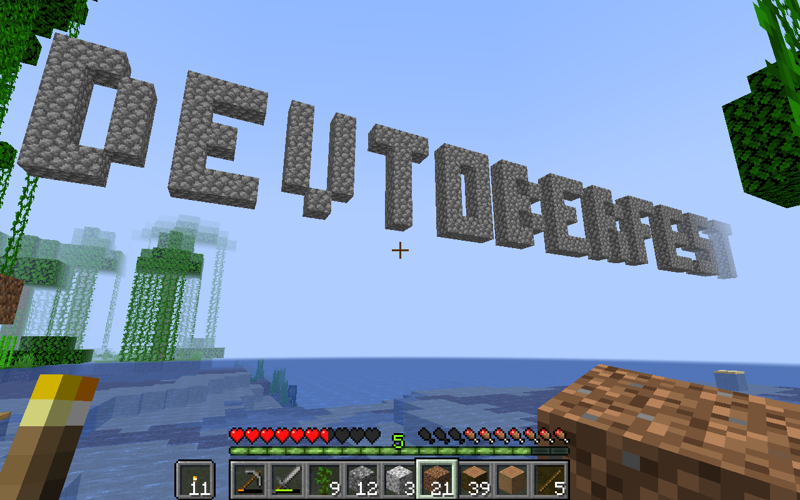

# Gaming Night

Welcome to the Gaming Night Event page! For this event it is all about challenging the SAP Developer Advocates and the Community in your favorite video game and will the Fun Friday Activity on October 29th. Although the [Discord server](https://discord.gg/8EDCdsYe7p) is already available and can be used to game with your fellow community members and form groups before the big gathering on Fun Friday. People can join Discord and form their own groups at any time during that day.  But the Dev Advocates will be online to game with the community at 3am US Eastern (for Asia Pacific) [🌎](https://www.timeanddate.com/worldclock/converter.html?iso=20211029T070000&p1=136&p2=37&p3=438&p4=240&p5=198), Noon-2pm US Eastern (for Europe) [🌎](https://www.timeanddate.com/worldclock/converter.html?iso=20211029T160000&p1=136&p2=37&p3=438&p4=240&p5=198) and 6-8pm US Eastern (for the Americas) [🌎](https://www.timeanddate.com/worldclock/converter.html?iso=20211029T220000&p1=136&p2=37&p3=438&p4=240&p5=198).

This event is thought not only for you to join and play video games but for the whole family! Just make sure that the age restrictions of the different games are fullfilled for the joining players.

Down below is a list of available games you can join and play. The list is not final and can be extended by **YOU**! To do so just edit the file and open a Pull Request for us to add the game to the list.

To communicate and interact with each other we provide a Discord server which you can join for the different gaming channels. [Devtoberfest Gaming Night Server](https://discord.gg/8EDCdsYe7p)

Platforms available:
- PC (Windows)
- MacOS
- Nintendo Switch (Nintendo Plus required)
- Playstation (Playstation Plus required)
- XBox (Xbox Live required)
- Mobile (iOS/ Android)

## List of Games

> Please go ahead and add games to the list.

### Multiplayer FPS (First Person Shooter)
- [Valorant (F2P)](https://playvalorant.com/)
- [Fortnite (F2P)](https://www.epicgames.com/fortnite/) (Thomas: PC; Riley: PC)
- [Call of Duty: Warzone (F2P)](https://www.callofduty.com/warzone)
- [Counter-Strike: Global Offensive (F2P)](https://store.steampowered.com/app/730/CounterStrike_Global_Offensive/)
- [Apex Legends (F2P)](https://www.ea.com/games/apex-legends)
- [Quake Champions (F2P)](https://quake.bethesda.net/en)
- [Team Fortress 2 (F2P)](http://www.teamfortress.com/) (Thomas: PC)

### Action
- [Red Dead Redemption 2](https://www.rockstargames.com/reddeadredemption2/) (Marius: Stadia) (Thomas: PC)

### Brawler
- [Warframe (F2P)](https://www.warframe.com/)
- [Brawlhalla (F2P)](https://www.brawlhalla.com/)
- [BattleBlock Theater](https://store.steampowered.com/app/238460/BattleBlock_Theater/)

### Sports
- [Rocket League (F2P)](https://www.rocketleague.com/)
- [Fifa21](https://www.ea.com/games/fifa/fifa-21) (Marius: Stadia)
- [NHL21](https://www.ea.com/de-de/games/nhl/nhl-21)
- [Madden22](https://www.ea.com/games/madden-nfl/madden-nfl-22) (Thomas: PC)
- [Everybody's Golf](https://store.playstation.com/de-de/product/EP9000-CUSA02171_00-0011223344556677/)

### Arcade Racing
- [Mario Kart 8 Deluxe](https://www.nintendo.de/Spiele/Nintendo-Switch/Mario-Kart-8-Deluxe-1173281.html)
- [Crash Team Racing: Nitro-Fueled](https://www.crashbandicoot.com/crashteamracing)
- [Wreckfest](https://order.wreckfestgame.com/) (Uwe: PC)
- [TrackMania Turbo](https://www.ubisoft.com/de-de/game/trackmania/turbo)
- [Grid](https://www.codemasters.com/game/grid/) (Uwe: PC + Stadia)

### Racing
- [RaceRoom Racing Experience](https://game.raceroom.com) (Uwe: PC)
- [Project CARS 2](https://www.projectcarsgame.com/two/) (Uwe: PC)

### RTS (Real Time Strategy)
- [Starcraft 2 (F2P)](https://starcraft2.com/)
- [Warcraft III: Reforged](https://playwarcraft3.com/)
- [Warhammer 40K: Gladius](https://store.steampowered.com/app/489630/Warhammer_40000_Gladius__Relics_of_War/)
- [Command & Conquer: Remastered](https://www.ea.com/de-de/games/command-and-conquer/command-and-conquer-remastered)
- [Sid Meier's Civilization VI](https://civilization.com/) (Thomas: PC; Riley: PC)

### MOBA (Multiplayer Online Battle Arena)
- [League of Legends (F2P)](https://na.leagueoflegends.com/en-us/)
- [Heroes of the Storm (F2P)](https://heroesofthestorm.com/en-us/)
- [Dota 2 (F2P)](https://www.dota2.com/play)

### Games w. Friends/ Other
- [Among Us](https://www.epicgames.com/store/de/p/among-us)
- [Fall Guys](https://store.steampowered.com/app/1097150/Fall_Guys_Ultimate_Knockout/)
- [Overcooked 2](https://store.steampowered.com/app/728880/Overcooked_2/) (Thomas: PC)
- [Human Fall Flat](https://store.steampowered.com/app/477160/Human_Fall_Flat/)
- [Broforce](https://www.broforcegame.com/)
- [Minecraft](https://www.minecraft.net/en-us)
- [MS Flight Simulator 2020](https://www.microsoft.com/de-de/p/microsoft-flight-simulator-standard-edition/9nxn8gf8n9ht?activetab=pivot:overviewtab) (Uwe: PC; Riley: PC)

### Fighting Games
- [Street Fighter V](https://streetfighter.com/)
- [Mortal Kombat 11](https://www.mortalkombat.com/)
- [Dragon Ball Fighter Z](https://store.steampowered.com/app/678950/DRAGON_BALL_FighterZ/)
- [Guilty Gear Strive](https://www.guiltygear.com/ggst/en/)
- [SoulCalibur VI](https://www.bandainamcoent.com/games/soulcalibur-vi)
- [Tekken 7](https://tk7.tekken.com/)

### MMORPG (Mass Multiplayer Online Role Playing Game)
- [Destiny 2 (F2P)](https://www.bungie.net/7/de/Destiny/NewLight)
- [Star Wars: The Old Republic (F2P)](https://www.swtor.com) (Thomas: PC)
- [Guild Wars 2 (F2P)](https://www.guildwars2.com/)
