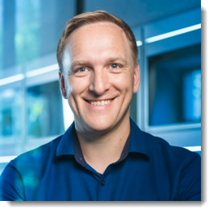
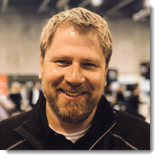
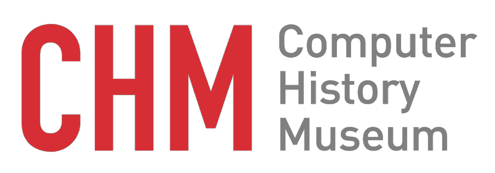
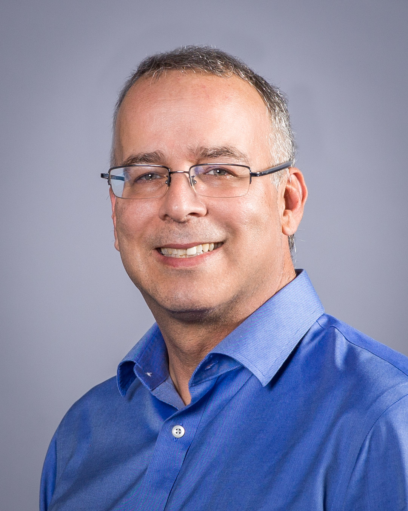

# Welcome to Devtoberfest! 😎

This topic content is for Devtoberfest Week 1 : 4 October → 08 October 2021.

Topic Owner: [Kevin Muessig](https://github.com/KevinMuessig)

Devtoberfest is the celebratory event by the SAP Developer Advocates for all Developers out there. Developers are the fundament of our modern world, as such they should be celebrated!

In the first week of Devtoberfest it is all about the event and getting the party started! You will learn what Devtoberfest is all about, you will get an introduction to the Grand Price Raffle as well as to the overall structure of Devtoberfest itself.

But not only is this an informational week but also your start into an amazing and fun event.

## Presentations

### Juergen Mueller and Thomas Grassl "Devtoberfest Launch Party"
Date: Wednesday, October 6th

Join us live to be part of the Devtoberfest 2021 Launch Party. Juergen Mueller, SAP Executive Board Member and CTO, will kick off the event and welcome everyone to another year of Devtoberfest.  He'll also discuss the close ties between Devtoberfest and TechEd, his thoughts on year-round learning for developers and give a sneak peek at some of the additions and improvements for SAP TechEd this year. 

Thomas Grassl, Global Head Developer and Community Relations, will join the party as well to give you insights as to what to expect over the next 6 weeks of Devtoberfest. He will highlight the topic weeks, how the Devtoberfest contest will work, preview the Fun Friday activities. 

So, don't miss out. Join the session live and be a part of the opening festivities.

[Join us live on YouTube](https://youtu.be/QECsPXQBP3E), and get involved in the conversation!

<table >
    <tr>
        <td width=250> </td>
        <td><b>Juergen Mueller</b> is an executive board member and CTO with global responsibility for technology and innovation across SAP. This comprises managing SAP’s overall platform and technology development, in short SAP Business Technology Platform (SAP BTP). SAP BTP includes database, services, and solutions like SAP HANA, SAP HANA Cloud, SAP Integration Suite, SAP Extension Suite, SAP Analytics Cloud, SAP Data Warehouse Cloud, and SAP’s intelligent technologies. I also lead the overall innovation agenda of SAP and build new business model- and market driven innovations supporting our customers’ long-term growth goals and strategies.</td>
    </tr>
    <tr>
        <td width=250> </td>
        <td><b>Thomas Grassl</b> is Global Head Developer and Community Relations - Leading programs for external community and developers, to collaborate, learn and get started with all the cool technologies and services we offer.</td>
    </tr>
</table>

## Fun Friday Activity
   
### A Virtual Tour of the “Revolution” Exhibition at the Computer History Museum By Dag Spicer, Senior Curator

Date: Friday, October 8th

© Computer History Museum

The story of computing is epic. It’s driven by the human passion for tinkering, inventing, and solving difficult problems, where accidents and luck can be as
important as brilliant engineering. 
Join Senior Curator Dag Spicer for a quick tour, followed by live Q&A of Revolution: The First 2000 Years of Computing, an
engaging 25,000-square-foot exhibition that chronicles the history of computing, from the abacus to the smartphone. 

[Join us live on YouTube](https://www.youtube.com/watch?v=M6SXIeXbnik), and get involved in the conversation!

<table >
    <tr>
        <td width=250> </td>
        <td><b>Dag Spicer</b> is the Museum’s senior curator. He is an electrical engineer and historian of science and technology. He began working at the Museum
            in 1996 and since then has helped guide the strategic direction of the Museum’s permanent collection, the largest and most comprehensive grouping of
            computers, software, media, oral histories, and ephemera in the world. He has played a key role in shaping the Museum’s exhibitions, programming, and
            education programs. Dag has given hundreds of interviews on computer history and related topics to major news outlets such as The Economist, The New
            York Times, NPR, CBS, VOA, Agence France-Presse, and many more, and has appeared on numerous television programs including Mysteries At The
            Museum and CBS Sunday Morning. He serves on several museum boards, as well the editorial board of the IEEE Annals of the History of Computing. He holds
            degrees from University of British Columbia (UBC), the University of Toronto, and Stanford University.</td>
    </tr>
</table>

### About CHM
The Computer History Museum (CHM) explores the computing past, digital present, and future impact of technology on humanity. Through research, events, and an
extensive collection of computing artifacts and oral histories, CHM is committed to shaping a better world by decoding technology for everyone. 

[Please visit us](https://computerhistory.org)

[Join the CHM Community](https://computerhistory.org/subscribe/)
 

## Points Earning Activities

For all activities new this week that can earn points towards the Devtoberfest Contest please see [here](../../contest/readme.md#week-1)
