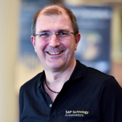

# Best Practices

This topic content is for Devtoberfest Week 2 : 11 October → 15 October 2021.

Learn how you can level up in the technical areas that you work in every day.

Topic Owner: [DJ Adams](https://github.com/qmacro)

## Presentations

### Best Practices for CAP Node.js Apps

Date and Time: Monday 11 October 08:00 BST (London) 09:00 CEST (Berlin) 12:30 IST (Bengaluru) 18:00 AEDT (Sydney) [🌎](https://www.timeanddate.com/worldclock/converter.html?iso=20211011T070000&p1=136&p2=37&p3=438&p4=240rl)

Duration: 45 mins

Hear directly from one of the CAP team members about best practices as they apply to designing and building CAP applications with Node.js.

[Join us live on YouTube](https://youtu.be/WTOOse-Flj8), and get involved in the conversation!

<table border="0px" width="100%">
<tr>
<td width="270"> </td>
<td>
<b>David Kunz</b> is a core developer for the Node.js runtime of the SAP Cloud Application Programming Model. After finishing his PhD in theoretical particle physics, David followed his vocation for programming. He is always striving to gain comprehensive knowledge of emerging technologies and advocates for superior paradigms and tools for efficient development.

<ul>
<li>SAP Community: <a href="https://people.sap.com/david.kunz2">https://people.sap.com/david.kunz2</a></li>
<li>GitHub: <a href="https://github.com/David-Kunz">https://github.com/David-Kunz</a></li>
<li>YouTube: <a href="https://www.youtube.com/channel/UCFU7a7OMYfcpjtIpu2j47_Q">https://www.youtube.com/channel/UCFU7a7OMYfcpjtIpu2j47_Q</a></li>
</ul>
</td>
</tr>
</table>

### Guidance for developing RAP applications in ABAP

Date and Time: Tuesday 12 October 08:00 BST (London) 09:00 CEST (Berlin) 12:30 IST (Bengaluru) 18:00 AEDT Sydney [🌎](https://www.timeanddate.com/worldclock/converter.html?iso=20211012T070000&p1=136&p2=37&p3=438&p4=240rl)

Duration: 45 mins

Hear directly from one of the pre-eminent developers in the ABAP RESTful Application Programming Model (RAP) space, about recommended techniques and approaches in the language that powers the core of SAP S/4HANA and many other platforms.

[Join us live on YouTube](https://youtu.be/AHEkbCDkn-E), and get involved in the conversation!

<table border="0px" width="100%">
<tr>
<td width="270"> </td>
<td>
<b>Andre Fischer</b> is a Product Manager for the SAP Business Technology ABAP Environment and SAP Gateway. He has been working on the topic of OData Service development since the launch of the SAP Gateway in 2011. You will find him as a speaker at various events such as SAP TechEd, SAP CodeJam, SAP Inside Track and SAP Online Track. 
  
He has written lots of blog posts about ABAP and OData service development and he is also supporting the SAP Community by answering questions in those areas. He is co-author of the SAP PRESS book "SAP Gateway and OData". In May he became SAP Champion after being active in the SAP Community as an SAP Mentor and SAP Technology Ambassador.

<ul>
<li>SAP Community: <a href="https://people.sap.com/andre.fischer">https://people.sap.com/andre.fischer</a></li>
<li>GitHub: <a href="https://github.com/David-Kunz">https://github.com/anfisc</a></li>
<li>Twitter: <a href="https://twitter.com/anfisc">https://twitter.com/anfisc</a></li>
</ul>
</td>
</tr>
</table>

### Continuous Integration and Delivery with SAP

Date and Time: Wednesday 13 October 08:00 BST (London) 09:00 CEST (Berlin) 12:30 IST (Bengaluru) 18:00 AEDT Sydney [🌎](https://www.timeanddate.com/worldclock/converter.html?iso=20211012T070000&p1=136&p2=37&p3=438&p4=240rl)

Duration: 45 mins

Hear directly from one of the team members of the CI/CD service on SAP Business Technology Platform, and learn about best practices in this area.

[Join us live on YouTube](https://youtu.be/BEZEdN9IMks), and get involved in the conversation!

<table border="0px" width="100%">
<tr>
<td width="270"> </td>
<td>
<b>Christoph Szymanski</b> is a Product Owner in the CI/CD space. He has been with SAP for more than 10 years - working on various CI/CD topics for SAP teams: infrastructure, tooling, processes. Recently, he's been trying to make our internal experience available to customers, via tools and products, talks and best practices.

<ul>
<li>SAP Community: <a href="https://people.sap.com/christoph.szymanski">https://people.sap.com/christoph.szymanski</a></li>
<li>LinkedIn: <a href="https://www.linkedin.com/in/christoph-szymanski-9b0484103">https://www.linkedin.com/in/christoph-szymanski-9b0484103</a></li>
<li>Twitter: <a href="https://twitter.com/ski_at_work">https://twitter.com/ski_at_work</a></li>
</ul>
</td>
</tr>
</table>

## Tutorials

Completion of any of the following tutorials during Devtoberfest will earn you points towards the contest and potentially some great prizes.  

Please find all the contest info here: [Contest Overview Page](https://github.com/SAP-samples/devtoberfest-2021/tree/main/contest)

* List of tutorials will be released as Week 2 approaches 

## Special Friday Activities

We have a couple of special activities for the end of this week!

### Special Guest Speaker

Date and Time: Friday 15 October 09:30 BST (London) 10:30 CEST (Berlin) 14:00 IST (Bengaluru) 19:30 AEDT (Sydney) [🌎](https://www.timeanddate.com/worldclock/converter.html?iso=20211015T083000&p1=136&p2=37&p3=438&p4=240)

Duration: 30 mins

On the Friday of this Best Practices week, we have special guest <b>James Governor</b>, analyst and co-founder of RedMonk. James will be chatting live with [Developer Advocate](https://developers.sap.com/developer-advocates.html) [DJ Adams](https://github.com/qmacro) about best practices in the cloud native space. James has a ton of experience from his connections, consulting and analysis work with some of the world's pre-eminent software vendors and companies employing cloud native practices.

[Join us live on YouTube](https://youtu.be/3Av2ve0nxCM), and get involved in the conversation!

<table border="0px" width="100%">
<tr>
<td width="270"> </td>
<td>
Here's James, in his own words:

Founded RedMonk in 2002 with Stephen O’Grady. We focus on developers as the real key influencers in tech. Understanding that people choose technology because of gut instincts not facts per se. An ex-journalist, I have managed teams and news agendas in weekly publication grind. IBM and MS watcher since 1995. Goals–build RedMonk. Specialities: Developers, developers, developers.

<ul>
<li>Online: <a href="https://redmonk.com/team/james-governor/">https://redmonk.com/team/james-governor/</a></li>
</ul>
</td>
</tr>
</table>

### Dogtoberfest!

Also on the Friday of this week (15 October) we have a furry and fun activity - [Dogtoberfest](../Dogtoberfest/)! Check out the dedicated page for more details.
