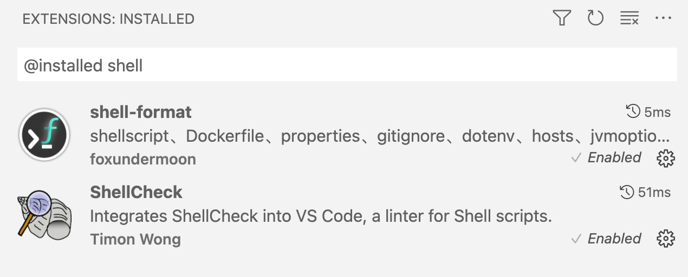
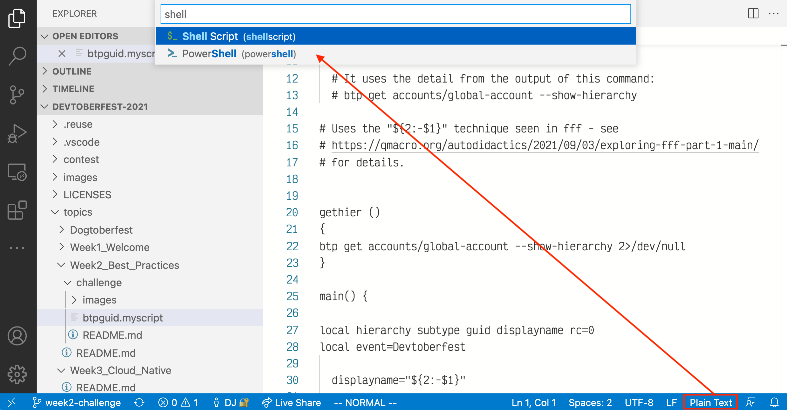

# Best Practices - Challenge

Welcome to the challenge for Week 2, the [Best Practices week](https://github.com/SAP-samples/devtoberfest-2021/tree/main/topics/Week2_Best_Practices).

## Overview

As a follow-up to the [Editor Extensions and Standards in the Modern World of Scripting and CLI Tools](https://github.com/SAP-samples/devtoberfest-2021/tree/main/topics/Week2_Best_Practices#editor-extensions-and-standards-in-the-modern-world-of-scripting-and-cli-tools) presentation in this week, we have a shell script that is in need of some attention. Everything you are to do in this challenge has been demonstrated in that presentation, so if you're in doubt about anything, you can always go back and [watch the replay](https://www.youtube.com/watch?v=BEZEdN9IMks) first.

From a high-level perspective, your task is to address the file naming, and the syntax & formatting issues in the file content, for the `btpguid.myscript` file, so that, as a result it complies with certain [script standards that are summarized below](#script-standards).

If you're after some brief background reading, there's a short blog post on [improving shell scripting](https://qmacro.org/2020/10/05/improving-my-shell-scripting/) which will introduce you to the three key standards-related items used in this challenge:

* a shell style guide
* `shellcheck` - a shell script static analysis tool
* `shfmt` - a shell parser, formatter and interpreter

## General Process

The general process you must follow for this challenge is:

* set up Microsoft VS Code on your machine if you haven't got it already
* install two [shell checking and formatting extensions](#shell-checking-and-formatting-extensions)
* fork this repository
* use VS Code and the extensions, combined with what you've seen in the presentation, to ensure the script complies with all the standards below
* submit a pull request (PR) with the exact title "WEEK2CHALLENGE" to this repository, containing the changes you made

## Awarding of Points

Your PR will be reviewed and points awarded according to how well you have completed the challenge, in other words, according to how close to the desired version you have taken the `btpguid.myscript` file.

## Shell Checking and Formatting Extensions

You should install the following two extensions to VS Code - these will help you complete the challenge:

* [ShellCheck](https://marketplace.visualstudio.com/items?itemName=timonwong.shellcheck) - this integrates [shellcheck](https://github.com/koalaman/shellcheck), a shell script static analysis tool
* [shell-format](https://marketplace.visualstudio.com/items?itemName=foxundermoon.shell-format) - this integrates [shfmt](https://github.com/mvdan/sh), a shell parser, formatter, and interpreter

## Script Standards

The file that you're to start with, [`btpguid.myscript`](btpguid.myscript), has a number of issues. To gain maximum points, you must address all of them.

### Style Guide Standards

In the [Shell Style Guide](https://google.github.io/styleguide/shellguide.html), the [File Extensions](https://google.github.io/styleguide/shellguide.html#file-extensions) section states:

> Executables should have no extension (strongly preferred)

This challenge requires the shell script to have no extension.

### No shellcheck Errors or Warnings

The `shellcheck` tool is an incredibly powerful facility that lints shell code and helps you avoid mistakes or bad practices. In fact it positively encourages best practices.

Use the ShellCheck extension in your VS Code installation to examine the issues that `shellcheck` highlights. It should emit messages at various severities - error, warning and information.

In order to have the extension present you with the issues, you need to first tell VS Code what type of contents the [`btpguid.myscript`](btpguid.myscript) is.

VS Code will probably fall back to assuming the content is plain text, so select that and tell it that the "language mode" is "shell", as shown:

> This would normally not be necessary for well-written scripts that don't have such a (deliberately) odd extension and that have a [shebang](https://en.wikipedia.org/wiki/Shebang_(Unix)) starting things off.

Attend to each and every message, dealing with all the issues. If you need help or hints on how to, you'll find them in the corresponding presentation [Editor Extensions and Standards in the Modern World of Scripting and CLI Tools](https://github.com/SAP-samples/devtoberfest-2021/tree/main/topics/Week2_Best_Practices#editor-extensions-and-standards-in-the-modern-world-of-scripting-and-cli-tools) (use the "watch" link to get to the [replay](https://www.youtube.com/watch?v=BEZEdN9IMks)).

The `shellcheck` tool is very accomplished and has rich and easy to read documentation in general, and specific documentation on every message it issues. Each message has an identifier that looks like this: `SCnnnn` where `nnnn` is a four digit number. You can look these up in the corresponding [wiki](https://github.com/koalaman/shellcheck/wiki), and there's a handy [summary list available too](https://gist.github.com/nicerobot/53cee11ee0abbdc997661e65b348f375#file-_shellcheck-md).

### Consistent Source Formatting

Formatting of the script must be consistent with the rules below; the best way to do this is to use the `shfmt` tool that the shell-format VS Code extension makes available.

The formatting options for `shfmt` can be specified in VS Code's preferences via the `shellformat.flag` setting, and should be `-i 2 -bn -ci -sr`, thus:

|Option|Meaning|
|-|-|
|`-i 2`|indent with 2 spaces|
|`-bn` |binary operations may start a line|
|`-ci` |switch cases will be indented|
|`-sr` |redirect operations will be followed by a space|

