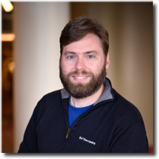

# Security

This topic content is for Devtoberfest Week 4 : 25 October → 29 October 2021.

Security, as a topic, has an interesting place for most developers.  While it's universally agreed to be an important topic; too often in the development process it becomes an afterthough or something left to "the security team". 

In this topic week we want to look at some general security topics that impacts all types of developers. We will look at how to protect your applications from hackers, how to deal with the Cloud Native security implications and how to write more secure code. 

For the tutorial and code challenge content of this week there will be a speacial focus on security within ABAP and the Node.js/JavaScript areas.

## Presentations 

### Cédric Hebert "Hackers Want Passwords"
Date and Time: Monday, October 25th at 17:00 CEST / 23:00 SGT / 11:00 EDT

75% of cloud intrusions are done through the usage of valid credentials. Can we do anything besides more stringent password rules? What about… poisoning the well?
  
In this presentation we will show you via three demos how cloud applications could actively fight against leaked credentials, password spreading and even phishing, by adopting honey passwords.

You don’t think this can work? I’d love to hear your reservations. Loving it? Then spread the word and help make the Internet a more secure place!

<table border=0px>
    <tr>
        <td width = 270>

</td>  <td><b>Cédric Hebert</b> is currently leading Active Defense research, Cédric is a French guy convinced that we can change people's opinion of cyber-security from 'boring' to 'exciting'.

As a certified expert of the Security Research team, he spends his time influencing SAP's security practices and products with innovating yet practical solutions. After kickstarting SAP's Threat Modeling approach and giving birth to the SAP Enterprise Threat Detection product, he thinks it’s time to tap into the potential of cyber-deception - and he will keep using his and his team's energy to make this happen.

Cédric’s drives are sharing knowledge, learning new things every day and supporting people in getting more secure (instead of blaming them for clicking on the wrong link !).</td>  </tr></table>

### Thomas Jung "Security Aspects of SAP Cloud Application Programming Model"
Date and Time: TBD

The SAP Cloud Application Programming Model comes out of the box with lots of best practice security baked into the framework.  However there are also things that each developer need to take responsiblity for when building applications with CAP. In this session we will look at techniques like adding XSUAA and roles, configuring Helmet for content security policies, and how to deal with CORS (Cross-Origin Resource Sharing)

<table border=0px>
    <tr>
        <td width = 270>

</td>  <td><b>Thomas Jung</b> is currently Head of Developer Advocacy, SAP Developer & Community Relations at SAP. This is a continuation of his long career in the SAP technology space. Throughout his career he's focused on the SAP applications developer and the tools and languages which support their activities with a particular interest in sharing knowledge through various channels both online and in person.</td>  </tr></table>

## Tutorials

Completion of any of the following tutorials during Devtoberfest will earn you points towards the contest and potentially some great prizes. to-do: link to contest overview page

* List of tutorials will be released as Week 5 approaches

## Coding Challenges

* The Coding Challenge details will be released during Week 5

## Fun Friday Activity

* The Fun Friday Activity for Week 5 will be details as we get closer to that week
