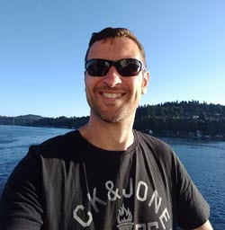

# Security

This topic content is for Devtoberfest Week 4 : 25 October → 29 October 2021.

Security, as a topic, has an interesting place for most developers.  While it's universally agreed to be an important topic; too often in the development process it becomes an afterthough or something left to "the security team". 

In this topic week we want to look at some general security topics that impacts all types of developers. We will look at how to protect your applications from hackers, how to deal with the Cloud Native security implications and how to write more secure code. 

For the tutorial and code challenge content of this week there will be a speacial focus on security within ABAP and the Node.js/JavaScript areas.

## Presentations 

### Cédric Hebert "Hackers Want Passwords"
Date and Time: Monday, October 25th at 17:00 CEST / 23:00 SGT / 11:00 EDT [🌎](https://www.timeanddate.com/worldclock/converter.html?iso=20211025T150000&p1=37&p2=198&p3=438&p4=240&p5=tz_sgt)

Duration: 50 mins

75% of cloud intrusions are done through the usage of valid credentials. Can we do anything besides more stringent password rules? What about… poisoning the well?
  
In this presentation we will show you via three demos how cloud applications could actively fight against leaked credentials, password spreading and even phishing, by adopting honey passwords.

You don’t think this can work? I’d love to hear your reservations. Loving it? Then spread the word and help make the Internet a more secure place!

[Join us live on YouTube](https://www.youtube.com/watch?v=zatXHKgPnec), and get involved in the conversation!

<table border=0px>
    <tr>
        <td width = 270>

</td>  <td><b>Cédric Hebert</b> is currently leading Active Defense research, Cédric is a French guy convinced that we can change people's opinion of cyber-security from 'boring' to 'exciting'.

As a certified expert of the Security Research team, he spends his time influencing SAP's security practices and products with innovating yet practical solutions. After kickstarting SAP's Threat Modeling approach and giving birth to the SAP Enterprise Threat Detection product, he thinks it’s time to tap into the potential of cyber-deception - and he will keep using his and his team's energy to make this happen.

Cédric’s drives are sharing knowledge, learning new things every day and supporting people in getting more secure (instead of blaming them for clicking on the wrong link !).</td>  </tr></table>

### "Security Round Table"
Date and Time: Tuesday, October 26th at 16:00 CEST / 22:00 SGT / 10:00 EDT [🌎](https://www.timeanddate.com/worldclock/converter.html?iso=20211026T140000&p1=37&p2=198&p3=438&p4=240&p5=tz_sgt)

Duration: 50 mins
Round table with security experts from SAP, Microsoft, and University. Supply chain attacks are a set of attack strategies with the goal to compromise companies mostly through vulnerabilities in their supply chain. Not only since the SolarWinds attack last year, attackers have been focusing more and more on finding vulnerabilities in their victims periphery to gain access the target network. The heavy usage of Open Source and new technologies like containers but also new operation approaches like DevOps and Infrastructure as Code add new attack vectors. This new attack vectors are challenging because they cannot easily prevented by traditional security systems and processes. In this talk, we will discuss the different types of supply chain attacks, we try to shape some light on the question who is involved and responsible and we will discuss how the likelihood of successful supply chain attacks can be reduced.

[Join us live on YouTube](https://www.youtube.com/watch?v=XTKbRdaiKEg), and get involved in the conversation!

<table border=0px>
<tr>
        <td width = 270>
        

</td>  <td><b>Michele Chubirka</b> is a recovering Unix and network engineer currently working as Chief Security Architect in SAP SuccessFactors. Her focus is Product Security with expertise in cloud-native security topics such as IaC, Kubernetes, containerization and software supply chains. Formerly the creator and official nerdstalker of the Healthy Paranoia Security Podcast, she has also been a freelance writer for various B2B publications such as TechTarget and Information Week, as well as an independent analyst. She likes long walks in hubsites, traveling to security conferences and spending time in the Bat Cave. Sincerely believes that every problem can be solved with a "for" loop. When not blogging or podcasting, can be found using up her 15 minutes in the <a href="https://twitter.com/MrsYisWhy" target="_blank">Twittersphere as MrsYisWhy</a>
</td>  </tr>
<tr>
        <td width = 270>
         

</td>  <td><b>Torsten Dangel</b> is a Security Expert with more than 20 years’ experience in IT. In his current role as Development Architect Security at SAP, he is responsible for defining application and operations security requirements and processes. He firmly believes in the power of collaboration and that security is achieved by people and culture and not by rules. As a CodeDojo mentor, Torsten teaches children in developing software. Besides IT, software and security, you can find Torsten on his bike, climbing up the hills.
</td>  </tr>

<tr>
        <td width = 270>

</td>  <td><b>Helen Oakley</b>, CISSP, is a Sr. Product Security Architect at SAP. She contributes to SAP’s cross product architecture and works as part of their Cyber & Defense team, defining application and operations security controls, standards, and frameworks. In her last role, Helen was a security architect for SAP’s Financial Services Industry applications where she implemented security and data privacy controls across banking and insurance portfolio. Helen is a co-founder of <a href="https://LeadingCyberLadies.com" target="_blank">LeadingCyberLadies.com</a> (a global community of women in cybersecurity) and is a teacher at HackStudent.com where they educate kids in ethical hacking. Helen is an advisory board member for a couple of cybersecurity start-ups and believes in giving back to the community. Twitter: <a href="https://twitter.com/e2hln" target="_blank">@e2hln</a>
</td>  </tr>
<tr>

<tr>
        <td width = 270>
        

</td>  <td><b>Sachar Paulus</b> is Professor for IT Security at Mannheim University of Applied Sciences. He holds a Ph.D. in number theory. He was working for SAP for 8 years in several security-related leading positions, among others, SVP Product Security and Chief Security Officer. His main research and transfer interests are Secure Software Development and Information Security for Small and Medium-Sized Enterprises. 
</td>  </tr>

<tr>
        <td width = 270>
 

</td>  <td><b>Ralf Wigand</b> is the National IT-Compliance & Security Officer at Microsoft Germany. As part of his role he contributes to Microsoft’s global IT-Compliance efforts with a focus on country-specific regulations like C5, but also to the general Microsoft’s cybersecurity strategy (like Critical Infrastructure). In his last role Ralf was part of the Azure Global engineering team driving the expansion of Azure into new regions worldwide, and before this he was for several year rewarded as Microsoft Most Valuable Professional MVP.
</td>  </tr>
</table>

### Thomas Jung "Security Aspects of SAP Cloud Application Programming Model"
Date and Time: Wednesday, October 27th at 17:00 CEST / 23:00 SGT / 11:00 EDT [🌎](https://www.timeanddate.com/worldclock/converter.html?iso=20211027T150000&p1=37&p2=198&p3=438&p4=240&p5=tz_sgt)

Duration: 50 mins

The SAP Cloud Application Programming Model comes out of the box with lots of best practice security baked into the framework.  However there are also things that each developer need to take responsibility for when building applications with CAP. In this session we will look at techniques like adding XSUAA and roles, configuring Helmet for content security policies, and how to deal with CORS (Cross-Origin Resource Sharing)

[Join us live on YouTube](https://www.youtube.com/watch?v=jQYMeN3jeOU), and get involved in the conversation!

<table border=0px>
    <tr>
        <td width = 270>

</td>  <td><b>Thomas Jung</b> is currently Head of Developer Advocacy, SAP Developer & Community Relations at SAP. This is a continuation of his long career in the SAP technology space. Throughout his career he's focused on the SAP applications developer and the tools and languages which support their activities with a particular interest in sharing knowledge through various channels both online and in person.</td>  </tr></table>

### Michele Chubirka "Container Security: It's All About the Supply Chain"
Date and Time: Thursday, October 28th at 17:00 CEST / 23:00 SGT / 11:00 EDT [🌎](https://www.timeanddate.com/worldclock/converter.html?iso=20211028T150000&p1=37&p2=198&p3=438&p4=240&p5=tz_sgt)

Duration: 50 mins

Slides: [devtoberfest_container_supply_chain.pdf](./devtoberfest_container_supply_chain.pdf)

Containers continue to mystify security practitioners, mostly because they don’t know how securing them fits into their existing programs. Is it a virtual machine that gets scanned by the same tools used for over a decade? Or is it an application package that should be tested by SCA, SAST and DAST tools? How do you manage the image or runtime vulnerabilities vs the application security issues? This talk will focus on container security as a supply chain lifecycle problem and how to integrate validation at multiple points to achieve the ultimate goal of *assurance.* The talk is tool agnostic, because security of the supply chain is more about the alignment with the software development process than the integration of a single magical tool. 

[Join us live on YouTube](https://www.youtube.com/watch?v=acEwqW-4R18), and get involved in the conversation!

<table border=0px>
    <tr>
        <td width = 270>

</td>  <td><b>Michele Chubirka</b> is a recovering Unix and network engineer currently working as Chief Security Architect in SAP SuccessFactors. Her focus is Product Security with expertise in cloud-native security topics such as IaC, Kubernetes, containerization and software supply chains. Formerly the creator and official nerdstalker of the Healthy Paranoia Security Podcast, she has also been a freelance writer for various B2B publications such as TechTarget and Information Week, as well as an independent analyst. She likes long walks in hubsites, traveling to security conferences and spending time in the Bat Cave. Sincerely believes that every problem can be solved with a "for" loop. When not blogging or podcasting, can be found using up her 15 minutes in the <a href="https://twitter.com/MrsYisWhy" target="_blank">Twittersphere as MrsYisWhy</a>
</td>  </tr></table>

## Tutorials & Other Points Earning Activities

* Completion of any of the following Tutorials & Activites during Devtoberfest will earn you points towards the contest and potentially some great prizes.  List of Week 4 Points Earning Activities published here: [Week 4 Points Earning Activities](https://github.com/SAP-samples/devtoberfest-2021/blob/main/contest/readme.md#week-4)

* Please find all the contest info here: [Contest Overview Page](https://github.com/SAP-samples/devtoberfest-2021/tree/main/contest)

## Coding Challenges

* The Coding Challenge details can be reviewed here: [https://github.com/SAP-samples/devtoberfest-2021-security-coding-challenge](https://github.com/SAP-samples/devtoberfest-2021-security-coding-challenge)

## Fun Friday Activity

* The Fun Friday Activity for Week 4 is the Devtoberfest Gaming Night.  See this separate page for all the details and upcomming schedule of Gaming Night activities. [Gaming Night Details](https://github.com/SAP-samples/devtoberfest-2021/blob/main/topics/Gaming_Night.md)
