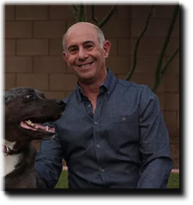

# Data & Analytics

This topic content is for Devtoberfest Week 5: November 1 → 5, 2021.

## Speakers

* Alan Simon "Enterprise-scale Analytical Data Architecture"
  * 
  * November 1st, 17:00 CET / 9am MST
  * Bio: ...

  * Abstract: ...

## Expert panels (WIP)

## Ask-the-Expert (WIP)

## Tutorials (WIP)

Completion of any of the following tutorials during Devtoberfest will earn you points towards the contest and potentially some great prizes.

### Mandatory
- [Get Started with SAP HANA Cloud](https://developers.sap.com/tutorials/hana-trial-advanced-analytics.html)
- [Use Machine Learning to Process Business Documents](https://developers.sap.com/mission.cp-aibus-extract-document-service.html)

### Optional
- [Get Started with a Standalone SAP HANA Cloud, Data Lake](https://developers.sap.com/mission.hana-cloud-data-lake-get-started.html)
- [Get Started with Your Trial in SAP Data Warehouse Cloud](https://developers.sap.com/mission.data-warehouse-cloud-get-started.html)
- [Get Started with SAP HANA Graph](https://developers.sap.com/group.hana-aa-graph-overview.html)
- [Smart Multi-Model Data Processing with SAP HANA Cloud](https://developers.sap.com/group.hana-cloud-smart-multi-model-data.html)
- [Use SAP HANA Cloud and QGIS for Spatial Analytics](https://developers.sap.com/group.hana-cloud-qgis-spatial.html)
- [Classify Data Records with the SDK for Data Attribute Recommendation](https://developers.sap.com/group.cp-aibus-data-attribute-sdk.html)

## Coding Challenge (TBD)

## Fun Friday Activity

Coding for Kids
