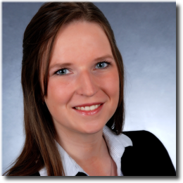

# Data && Analytics

This topic content is for Devtoberfest Week 5: November 1 → 5, 2021.

Times were never more exciting for developers working with data. Data analysts, data scientists and data engineers all have important role in building Enterprise Data Landscape of today and tomorrow using SAP technologies.

## Presentations

### The Modern Enterprise Data Landscape
November 2nd, 17:00 CET / 9am MST

Enterprise-scale data management has long been a highly complex and often frustrating proposition. Today, with data warehouses and data marts, data lakes, data lakehouses, data fabric, data mesh, multimodel data platforms and more… your alternatives can be mind-numbing and make you feel as if you’ll never reach your enterprise data management goals.

40-year technology veteran Alan Simon untangles and demystifies the enterprise data management landscape, helping you leap beyond jargon and the latest hot trends through a grounded-in-reality approach to address your longstanding challenges. Whether you are a newcomer to enterprise data or a longtime practitioner, this presentation will help expand your personal data management solutions portfolio and navigate the ever-changing enterprise data landscape.

<table border=0px>
<tr>
<td width = 270></td>
<td><b>Alan Simon</b> is the Managing Principal of Thinking Helmet, Inc. and a long-time enterprise data management consultant. He is the author of 32 technology, business, and career-oriented books dating back to 1985, including the original edition of Data Warehousing For Dummies and the just-released Data Lakes For Dummies. He previously led global and national consulting practices with several firms, and also teaches university courses in his specialty areas.  Alan lives in the Phoenix, Arizona area and is a native of Pittsburgh, Pennsylvania, USA.</td>
</tr>
</table>

### Demystifying Data Science in the Enterprise
November 2nd, 10:00 CET / 5pm SGT (tbc)

Data Science has been a hot topic in the enterprise in the last decade. Thanks to advances in deep learning, the role of data scientists has expanded into new applications, namely building AI services.

In this talk we describe machine learning use-cases from our team and describe our learnings and takeaways.

<table border=0px>
<tr>
<td width = 270></td>
<td><b>Dr. <a href="https://people.sap.com/manuel.zeise">Manuel Zeise</a></b> is a principal data scientist at the Deep Learning Center of Excellence in Walldorf. He began his career at SAP in 2013, working in Consulting and Custom Development as a data scientist, before transferring to the Deep Learning CoE in 2018.  Prior to this, Manuel earned a PhD in high energy physics from the Institut für Experimentelle Kernphysik in Karlsruhe and worked as a postdoctoral researcher.</td></tr>
<tr><td width = 270></td>
<td><b>Dr. Stefan Baur</b> is a senior data scientist at the Deep Learning Center of Excellence for SAP AI Business Services. He has several years of experience in developing deep learning models for SAP’s AI-powered products, including the document information extraction solution and the productization of the Generic-Line-Item-Matching model in CashApp, where he currently serves as project lead of the data science team.  Before joining SAP, Stefan obtained a PhD in theoretical condensed matter physics from Cornell University and served as a postdoctoral researcher at the University of Cambridge.</td>
</tr>
</table>

### Data Visualization: Then and Now
November 4th, 10:00 CET / 5pm SGT

Data Visualization is the new old topic. Surprisingly its history is not that long even if spreadsheets made data exploration ubiquitous. But as Data is moving into 3xV directions (Volume, Velocity and Variety) so is modern Visualization of it. After going through a bit of a theory we will move into practical aspects of Data Storytelling and Exploratory Data Analysis.

<table border=0px>
<tr>
<td width = 270></td>
<td>As an SAP Developer Advocate <strong><a href="https://people.sap.com/vitaliy.rudnytskiy">Vitaliy Rudnytskiy</a></strong> focuses on all ways developers are collecting data and turning it into value using the SAP Business Technology Platform. His main interests are in big data and fast data technologies, IoT, analytics, and data visualization.  
Before joining SAP, he worked as a technology consultant in Europe and in the U.S. Vitaliy is a visiting lecturer at the WSB University in Wrocław.</td>  
</tr>
</table>

## Meet-the-Author
Meet and greet authors of bestselling books on the topics of SAP Data and Analytics!

Meet-the-Author gives you direct access to authors who will present their professional stories, share experience, and offer writing tips. During these live panels, authors will describe writing and publishing process, their own approaches to learning, and ways to stay current with the constantly evolving tech world. They are looking forward to your questions too!

November 3rd, 9:00 CET and 17:00 CET (tbc)

   

Confirmed authors:
* Melanie Holzapfel, co-author of "[Designing Dashboards with SAP Analytics Cloud](https://www.rheinwerk-verlag.de/designing-dashboards-with-sap-analytics-cloud/)"
* [Dharma Teja Atluri](https://people.sap.com/dharmateja.atluri), co-author of "[SAP Data Intelligence: The Comprehensive Guide](https://www.sap-press.com/sap-data-intelligence_5369/)"
* [Thorsten Lüdtke](https://people.sap.com/biportal), co-author of "[SAP BW/4HANA 2.0: The Comprehensive Guide](https://www.sap-press.com/sap-bw4hana-20_4544/)"
* [Stefan Hartmann](https://people.sap.com/stefan.hartmann.dtt), co-author of "[Practical Guide to SAP HANA and Big Data Analytics](https://www.espresso-tutorials.de/produkt/practical-guide-to-sap-hana-and-big-data-analytics/)"
* [Heather Hill](https://people.sap.com/heather89), co-author of "[SAP BusinessObjects Web Intelligence: The Comprehensive Guide](https://www.sap-press.com/sap-businessobjects-web-intelligence_4412/)"

## Ask-the-Expert: Data Science in practice

We got recognized experts and active community members to join a panel discussing and answering your questions about real-life experience in preparing, training, deploying and maintaining Machine Learning models.

November 4th, 16:00 CET / 8am PST (tbc)

  

* [Sarah Detzler](https://people.sap.com/sarah.detzler), Competence Lead Data Science and Machine Learning
* [Andreas Forster](https://people.sap.com/andreas.forster), Machine Learning enthusiast in SAP's global Center of Excellence
* [Karthik Muthuswamy](https://people.sap.com/krtk), Senior Data Scientist working on Machine Learning research for developing intelligent applications for enterprise software

## Coding Challenge
Use SAP HANA for some fun geospatial exploration!

Please, stay tuned for details.

## Fun Friday Activity

Let's talk **Coding for Kids**!

Please, stay tuned for details.
