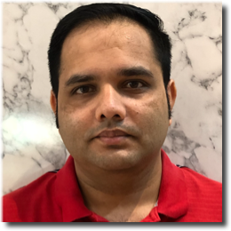
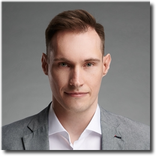

# Data & Analytics

This topic content is for Devtoberfest Week 5: November 1 → 5, 2021.

Times were never more exciting for developers working with data. Data analysts, data scientists and data engineers all have important role in building Enterprise Data Landscape of today and tomorrow using SAP technologies.

Topic Owner: [Vitaliy Rudnytskiy](https://people.sap.com/vitaliy.rudnytskiy)

## Presentations

All sessions are about 60 minutes long, including time for your questions.

### Demystifying Data Science in the Enterprise
November 2nd, [10:00 CET / 14:30 IST / 17:00 SGT](https://www.timeanddate.com/worldclock/converter.html?iso=20211102T090000&p1=136&p2=83&p3=367&p4=438&p5=236&p6=248&p7=240)

Data Science has been a hot topic in the enterprise in the last decade. Thanks to advances in deep learning, the role of data scientists has expanded into new applications, namely building AI services.

In this talk we describe machine learning use-cases from our team and describe our learnings and takeaways.

📺 [Join us live on YouTube](https://developers.sap.com/tutorials/devtoberfest-week-5-speaker.html#4ab1d558-f4aa-49ed-95b7-f4e7bada1f93), and ask your questions!

<table border=0px>
<tr>
<td width = 270></td>
<td><b>Dr. <a href="https://people.sap.com/manuel.zeise">Manuel Zeise</a></b> is a principal data scientist at the Deep Learning Center of Excellence in Walldorf. He began his career at SAP in 2013, working in Consulting and Custom Development as a data scientist, before transferring to the Deep Learning CoE in 2018.  Prior to this, Manuel earned a PhD in high energy physics from the Institut für Experimentelle Kernphysik in Karlsruhe and worked as a postdoctoral researcher.</td></tr>
<tr><td width = 270></td>
<td><b>Dr. <a href="https://people.sap.com/s.baur">Stefan Baur</a></b> is a senior data scientist at the Deep Learning Center of Excellence for SAP AI Business Services. He has several years of experience in developing deep learning models for SAP’s AI-powered products, including the document information extraction solution and the productization of the Generic-Line-Item-Matching model in CashApp, where he currently serves as project lead of the data science team.  Before joining SAP, Stefan obtained a PhD in theoretical condensed matter physics from Cornell University and served as a postdoctoral researcher at the University of Cambridge.</td>
</tr>
</table>

### The Modern Enterprise Data Landscape
November 2nd, [17:00 CET / 09:00 MST / 21:30 IST](https://www.timeanddate.com/worldclock/converter.html?iso=20211102T160000&p1=83&p2=45&p3=179&p4=64&p5=155&p6=224&p7=197&p8=438)

Enterprise-scale data management has long been a highly complex and often frustrating proposition. Today, with data warehouses and data marts, data lakes, data lakehouses, data fabric, data mesh, multimodel data platforms and more… your alternatives can be mind-numbing and make you feel as if you’ll never reach your enterprise data management goals.

40-year technology veteran Alan Simon untangles and demystifies the enterprise data management landscape, helping you leap beyond jargon and the latest hot trends through a grounded-in-reality approach to address your longstanding challenges. Whether you are a newcomer to enterprise data or a longtime practitioner, this presentation will help expand your personal data management solutions portfolio and navigate the ever-changing enterprise data landscape.

📺 [Join us live on YouTube](https://youtu.be/fCVFb_xk1Gg), and ask your questions!

<table border=0px>
<tr>
<td width = 270></td>
<td><b>Alan Simon</b> is the Managing Principal of Thinking Helmet, Inc. and a long-time enterprise data management consultant. He is the author of 32 technology, business, and career-oriented books dating back to 1985, including the original edition of Data Warehousing For Dummies and the just-released Data Lakes For Dummies. He previously led global and national consulting practices with several firms, and also teaches university courses in his specialty areas.  Alan lives in the Phoenix, Arizona area and is a native of Pittsburgh, Pennsylvania, USA.</td>
</tr>
</table>

### Data Visualization: Then and Now
November 4th, [10:00 CET / 14:30 IST / 17:00 SGT](https://www.timeanddate.com/worldclock/converter.html?iso=20211104T090000&p1=136&p2=83&p3=367&p4=438&p5=236&p6=248&p7=240)

Data Visualization is the new old topic. Surprisingly its history is not that long even if spreadsheets made data exploration ubiquitous. But as Data is moving into 3xV directions (Volume, Velocity and Variety) so is modern Visualization of it. After going through a bit of a theory we will move into practical aspects of Data Storytelling and Exploratory Data Analysis.

📺 [Join us live on YouTube](https://youtu.be/HB9-lbnsHaA), and ask your questions!

<table border=0px>
<tr>
<td width = 270></td>
<td>As an SAP Developer Advocate <strong><a href="https://people.sap.com/vitaliy.rudnytskiy">Vitaliy Rudnytskiy</a></strong> focuses on all ways developers are collecting data and turning it into value using the SAP Business Technology Platform. His main interests are in big data and fast data technologies, IoT, analytics, and data visualization.  
Before joining SAP, he worked as a technology consultant in Europe and in the U.S. Vitaliy is a visiting lecturer at the WSB University in Wrocław.</td>  
</tr>
</table>

## Meet-the-Author
Meet and greet authors of bestselling books on the topics of SAP Data and Analytics!

Meet-the-Author gives you direct access to authors who will present their professional stories, share experience, and offer writing tips. During these live panels, authors will describe writing and publishing process, their own approaches to learning, and ways to stay current with the constantly evolving tech world. They are looking forward to your questions too!

### Panel 1
November 3rd, [10:00 CET / 14:30 IST /  17:00 SGT](https://www.timeanddate.com/worldclock/converter.html?iso=20211103T090000&p1=136&p2=83&p3=367&p4=438&p5=236&p6=248&p7=240)

📺 [Join us live on YouTube](https://youtu.be/n_TPj9OYP5M), and get involved in the conversation!

   

* [Dharma Teja Atluri](https://people.sap.com/dharmateja.atluri), co-author of "[SAP Data Intelligence: The Comprehensive Guide](https://www.sap-press.com/sap-data-intelligence_5369/)"
* [Thorsten Lüdtke](https://people.sap.com/biportal), co-author of "[SAP BW/4HANA 2.0: The Comprehensive Guide](https://www.sap-press.com/sap-bw4hana-20_4544/)"
* [Stefan Hartmann](https://people.sap.com/stefan.hartmann.dtt), co-author of "[Practical Guide to SAP HANA and Big Data Analytics](https://www.espresso-tutorials.de/produkt/practical-guide-to-sap-hana-and-big-data-analytics/)"

### Panel 2
November 3rd, [17:00 CET / 09:00 PST](https://www.timeanddate.com/worldclock/converter.html?iso=20211103T160000&p1=83&p2=45&p3=179&p4=64&p5=155&p6=224)

📺 [Join us live on YouTube](https://youtu.be/l5eSm6c3lmk), and get involved in the conversation!

  

* [Melanie Holzapfel](https://people.sap.com/melanie.holzapfel), co-author of "[Designing Dashboards with SAP Analytics Cloud](https://www.rheinwerk-verlag.de/designing-dashboards-with-sap-analytics-cloud/)"
* [Heather Hill](https://people.sap.com/heather89), co-author of "[SAP BusinessObjects Web Intelligence: The Comprehensive Guide](https://www.sap-press.com/sap-businessobjects-web-intelligence_4412/)"
* [Konrad Załęski](https://people.sap.com/konrad), author of "[Data Modeling with SAP BW/4HANA 2.0: Implementing Agile Data Models Using Modern Modeling Concepts](https://www.apress.com/gp/book/9781484270882)"

## Ask-the-Expert: Data Science in practice
November 4th, [16:00 CET / 11:00 EDT / 20:30 IST](https://www.timeanddate.com/worldclock/converter.html?iso=20211104T150000&p1=83&p2=45&p3=179&p4=64&p5=155&p6=224)

We got recognized experts and active community members to join a panel answering your questions about real-life experience in preparing, training, deploying and maintaining Machine Learning models using SAP HANA, SAP Analytics Cloud, SAP Data Intelligence, SAP AI Business Services and SAP AI Foundation.

📺 [Join us live on YouTube](https://www.youtube.com/watch?v=MU_W2J-uQbI), and get involved in the conversation!

  

* [Sarah Detzler](https://people.sap.com/sarah.detzler), Competence Lead Data Science and Machine Learning
* [Andreas Forster](https://people.sap.com/andreas.forster), Machine Learning enthusiast in SAP's global Center of Excellence
* [Karthik Muthuswamy](https://people.sap.com/krtk), Senior Data Scientist working on Machine Learning research for developing intelligent applications for enterprise software

## Tutorials & Other Points Earning Activities

* List of Data && Analytics week's Points Earning Activities published here:  [Week 5 Points Earning Activities](https://github.com/SAP-samples/devtoberfest-2021/blob/main/contest/readme.md#week-5)

Please find all the contest info here: [Contest Overview Page](https://github.com/SAP-samples/devtoberfest-2021/tree/main/contest)

## Coding Challenge

Use SAP HANA for some fun geospatial exploration while solving the coding challenge [using SAP HANA multi-model capabilities](https://developers.sap.com/tutorials/devtoberfest-week-5-codingchallenge.html#7cb08de7-399e-4a37-a9be-e181c18e9dee) and get some Devtoberfest points for providing correct answers!

Optionally, consider putting your geospatial skills to use in the separate [30 Day Map Challenge](https://github.com/tjukanovt/30DayMapChallenge) 🌏🌍🌎

## Fun Friday Activity

### Let's talk **Coding for Kids**!

Did you know that SAP makes its own visual programming language for Computing Education? Let us tell (and show) you all about it: [Snap! Build Your Own Blocks](https://snap.berkeley.edu/) is the programming language kids in Silicon Valley learn in high school and college students at UC Berkeley use to explore the Beauty and Joy of Computing. We'll take you on an exclusive backstage tour of our R&D lab.

### Snap! Designing a Programming Language for All Children

November 5th, [10:00 CET / 14:30 IST / 17:00 SGT](https://www.timeanddate.com/worldclock/converter.html?iso=20211105T090000&p1=136&p2=83&p3=367&p4=438&p5=236&p6=248&p7=240)

Snap! is an interactive, massively parallel visual programming language implemented inside its own multi-threaded graphical user interface framework. It is a free and open-source software project deployed in web browsers and is used in educational institutions and  "out in the wild" around the globe.

We develop Snap! at SAP in collaboration with researchers at UC Berkeley. Join us for a virtual tour of our "Lab" and learn about our design principles, architecture and pedagogical mission.

📺 [Join us live on YouTube](https://developers.sap.com/tutorials/devtoberfest-week-5-fun-friday.html#363116a7-849e-4701-bb6a-79b5068875d7), and get involved!

### Snap! Programming Beauty and Joy

November 5th, [16:00 CET / 08:00 PST](https://www.timeanddate.com/worldclock/converter.html?iso=20211105T150000&p1=83&p2=45&p3=179&p4=64&p5=155&p6=224)

Snap! is the programming language that has been developed for UC Berkeley's "Beauty and Joy of Computing" course. It highlights powerful ideas in computing by encouraging learners to create visually appealing and mathematically elegant artifacts.

In this session we'll show you all about Snap! and invite you to explore classical algorithmic art through recoding and remixing.

📺 [Join us live on YouTube](https://developers.sap.com/tutorials/devtoberfest-week-5-fun-friday.html#caa82262-28af-48c1-b58e-aa57f1bfeba3), and get involved!

<table border=0px>
<tr><td width = 270></td>
<td><b><a href="https://people.sap.com/jmoenig">Jens Mönig</a></b> is not just the Lead developer of <b>Snap!</b>, but also a researcher at SAP and a Lawyer – quite an interesting combination 🙂 Together with Brian Harvey from the University of California in Berkeley, he developed this visual programming language.  Jens has been awarded the National Technology Leadership Summit (NTLS) Education Technology Leadership Award, which recognizes individuals who have made a significant impact in the field of educational technology over the course of a lifetime.</td>
</tr>
<tr>
<td width = 270>
</td>
<td>
Originally a biologist, <b><a href="https://people.sap.com/jadga.huegle">Jadga Hügle</a></b> discovered her interest in computer science while building a small connected greenhouse.  Since then, she has become a Snap! enthusiast and is eager to share her excitement with everyone. Jadga currently works for SAP’s Snap! team.</td></tr>
</table>
