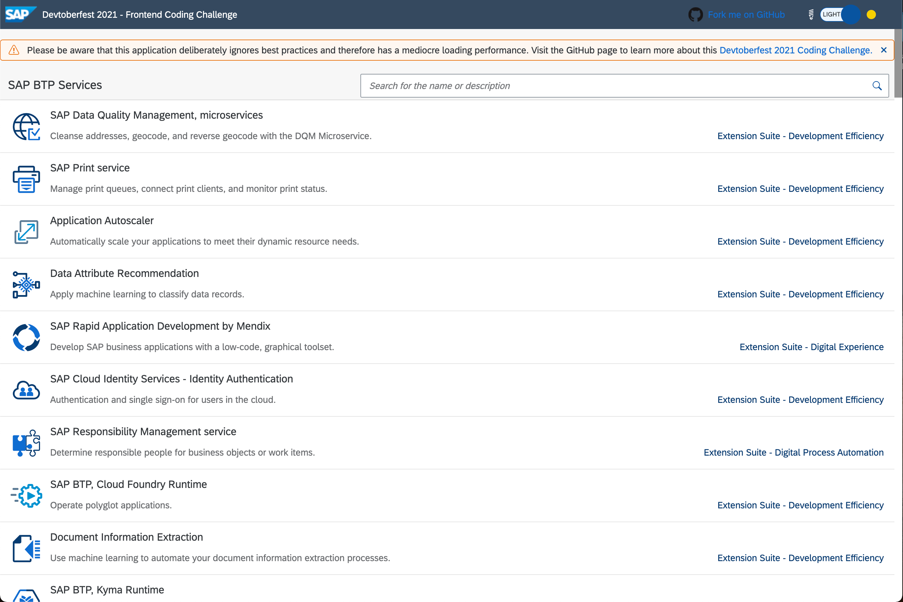

# Frontend

This topic content is for Devtoberfest Week 6 : 8 November → 12 November 2021.

The frontend is the only project component that your business users will ever interact with directly. Consequentially, its implementation will shape the first impression of your project - So make it count!

In this topic week, we look at some general trends topics that impact your web-based frontend. Each session will focus on upcoming industry trends and relate SAP's frameworks and services to its developer ecosystem. As this topic area to so incredibly wide, we'll concentrate on web-based frontends. This also avoids certain limitations on the development requirements that would come with native application development.

For this week's tutorial and code challenge content, we preselected a set of tutorials that cover four different web frameworks. This should empower developers to pick the framework they feel most comfortable in (Bonus points if you do several of them).

Topic Owner: [Marius Obert](https://github.com/iobert)

## Presentations

### Free your Web Apps from Speed Bumps
Monday November 8th at 10:00 CET (Berlin) / 14:30 IST (Bengaluru) / 20:00 AEDT (Melbourne) [🌏🌍🌎](https://www.timeanddate.com/worldclock/converter.html?iso=20211108T090000&p1=152&p2=438&p3=83&p4=45&p5=179&p6=64&p7=155&p8=197&p9=224)

Duration: 35 minutes

Nobody likes web applications with a bad performance - neither the end-users nor the developers. Join this session to learn about some common strategies that improve the performance score of your web app and tools to measure this improvement.
We will cover genic tips and tricks and specific ones for SAPUI5/OpenUI5 applications to help you with this week's coding challenge.

[Join us live on YouTube](https://www.youtube.com/watch?v=CBF_8eOjuc8), and get involved in the conversation!
[View the slides here](slides/WebAppOptimization.pdf).

<table >
    <tr>
        <td width=250></td>
        <td><b><a href="https://people.sap.com/mariusobert">Marius Obert</a></b> started his software development career as a UI developer in sunny California. After many ugly fights against CSS, he relocated to Munich, where he now works as a Developer Advocate for SAP BTP and SAP UI technologies.     In his spare time, he tries to keep up to speed with cryptocurrencies and distributed ledger technologies in general.
    </tr>
</table>

### Micro Frontends with Luigi – UI Development at Scale
November 9th, 9:00 CET (Berlin) / 13:30 IST (Bengaluru) / 19:00 AEDT (Melbourne) [🌏🌍🌎](https://www.timeanddate.com/worldclock/converter.html?iso=20211109T080000&p1=152&p2=438&p3=83&p4=45&p5=179&p6=64&p7=155&p8=197&p9=224)

Duration: 30 minutes

This session will give insights about a trending topic in frontend development - Micro Frontends. This architecture style addresses the challenge of having a frontend that is too big to manage and coordinate across multiple teams or products. You will learn about its key aspects, technical and organizational issues it induces, and how these can be handled, on the example of project "Luigi", SAP's own open-source Micro Frontend framework.

[Join us live on YouTube](https://www.youtube.com/watch?v=EzQK0v7xBuE), and get involved in the conversation!
[View the slides here](slides/MicroFrontends.pdf).

<table >
    <tr>
        <td width=250></td>
        <td><b><a href="https://www.linkedin.com/in/philipp-pracht-3671b699">Philipp Pracht</a></b> is the Product Owner and Architect of project “Luigi”, SAP’s open-source micro frontend framework for business and admin UIs. He is in the company for 13 years now, and during that time, he was working on various UI-related topics and frameworks.   Philipp is part of the T&I BTP Foundational Plane Team and lives in Munich.</td>
    </tr>
</table>

### Apollo GraphQL Usage in UI5 Apps
November 9th, 17:00 CET (Berlin) / 11:00 EST (New York) / 8:00 PST (San Francisco) [🌏🌍🌎](https://www.timeanddate.com/worldclock/converter.html?iso=20211109T160000&p1=152&p2=438&p3=83&p4=45&p5=179&p6=64&p7=155&p8=197&p9=224)

Duration: 30 minutes

This session will showcase how easy it is today to integrate any OSS library such as Apollo GraphQL into UI5 by using the UI5 CLI tooling. Besides the OSS integration, the session demonstrates how seamless it can be to use Apollo GraphQL inside UI5 applications.

[Join us live on YouTube](https://www.youtube.com/watch?v=eeIt_EFpbeQ), and get involved in the conversation!
[View the slides here](slides/MissionApolloReloaded.pdf).

<table >
    <tr>
        <td width=250> </td>
        <td><b> <a href="https://people.sap.com/peter.muessig">Peter Muessig</a></b>  is an initial member of the Phoenix project, today known as OpenUI5 and SAPUI5. He has grown into the role of the UI5 Chief Architect, mainly focusing on UI innovation in the area of the UI framework (UI5 Evolution, UI5 Core), rendering (UI5 Controls, UI5 Web Components), development experience (UI5 Tooling).</td>
    </tr>
    <tr>
        <td width=250> </td>
        <td><b><a href="https://damianmaring.com/">Damian Maring</a></b> is an Area Architect focusing on UI/UX topics in the Procurement Area. He's also a founding member of "Deploy with Confidence", working on tools for delivering cloud-native SaaS applications. Very early on in his development career, he found his passion in front-end technologies. After joining SAP in 2012, he looked into the newest UI-related technologies and spreading them throughout the company, including UI5, Vue.js, GraphQL, and many more.   Together with his team, he has built tools to improve the developer experience and raise quality awareness for the whole solution.</td>
    </tr>
</table>

### Web Components: The Reusable Building Blocks of the Web
November 11th, 9:00 CET (Berlin) / 13:30 IST (Bengaluru) / 19:00 AEDT (Melbourne) [🌏🌍🌎](https://www.timeanddate.com/worldclock/converter.html?iso=20211111T080000&p1=152&p2=438&p3=83&p4=45&p5=179&p6=64&p7=155&p8=197&p9=224)

Duration: 30 minutes

If you are looking for a way of implementing reusable components with Vanilla JavaScript and no framework-specific dependencies, then this session might be just for you. In this talk, we will take a deep dive into the Web Components standards:
- Custom Elements
- Shadow DOM
- HTML Templates
- ES Modules

We will put our new knowledge into practice by implementing our first Web Component. Moreover, we will take a glance at the usage of Web Components within the SAP ecosystem.

[Join us live on YouTube](https://www.youtube.com/watch?v=b_Hqu4GtJvM), and get involved in the conversation!
[View the slides here](slides/WebComponents.pdf).

<table >
    <tr>
        <td width=250> </td>
        <td><b><a href="https://people.sap.com/fifoosid">Filip Siderov</a></b> is an Information System graduate, open-source & hackathon enthusiast, JavaScript lover & a senior JavaScript developer at SAP. He has dedicated his last three years working on UI5 Web Components.</td>
    </tr>
</table>

### How to Make State Management Work for You with Redux and Redux Toolkit 

November 11th, 19:00 CET (Berlin) / 13:00 EST (New York) / 10:00 PST (San Francisco) [🌏🌍🌎](https://www.timeanddate.com/worldclock/converter.html?iso=20211111T180000&p1=152&p2=438&p3=83&p4=45&p5=179&p6=64&p7=155&p8=197&p9=224)

Duration: 40 minutes

State management for the frontend. No more sinking props down layers of components and bubbling results back up. Access all your common data in one place with Redux! In this presentation, I will walk through what Redux is, why you would use it, how you would use it, and how you could simplify it with Redux Toolkit.

[Join us live on YouTube](https://www.youtube.com/watch?v=Eo5kYkiTvrQ), and get involved in the conversation!

<table >
    <tr>
        <td width=250> </td>
        <td><b><a href="https://www.linkedin.com/in/michelle-moudy-57216716a/">Michelle Moudy</a></b>  is a frontend dev and is currently working for SAP Eureka on Returns Management.
        She attended the first cohort of the SAP Academy for Engineering, where she worked with a team to design and implement a solution for Circular Economy. Her team designed a recycling app with configurable bins, using OCR to identify objects.
        Her interests mainly lie in frontend development, and teaching other developers frontend isn't nearly as bad as they think.</td>
    </tr>
</table>

## Tutorials & Other Points Earning Activities

* Completion of any of the following Tutorials & Activites during Devtoberfest will earn you points towards the contest and potentially some great prizes.  List of Week 6 Points Earning Activities published here:  [Week 6 Points Earning Activities](https://github.com/SAP-samples/devtoberfest-2021/blob/main/contest/readme.md#week-6) 
 
* Please find all the contest info here: [Contest Overview Page](https://github.com/SAP-samples/devtoberfest-2021/tree/main/contest)

## Coding Challenge

Go here to find the [Devtoberfest 2021 Frontend Week Coding Challenge](https://github.com/SAP-samples/devtoberfest-2021-frontend-coding-challenge). The repo contains a web application that displays all current services available on the SAP Business Technology Platform. 

Unfortunately, this app doesn't have the best loading performance. The [Lighthouse performance score](https://web.dev/performance-scoring/) is way below the achievable 100 points. Luckily, this is not the fault of the framework used but happened due to a bad implementation and disregard of [common best practices](https://www.youtube.com/watch?v=CBF_8eOjuc8). It’s up to you to fix this web application and to push the performance score above 70.

To participate, you need to fork and clone the repository first. Once you made the improvements, open a pull request that will be reviewed automatically. If your app passes, your pull request gets a "passed" label, and you can enter your SAP Community ID to earn your badge. For more detailed instructions, please look at the "Contributing" section of the [coding challenge repository](https://github.com/SAP-samples/devtoberfest-2021-frontend-coding-challenge#contributing--submitting-your-proposal).

## Fun Friday Activities

### Pub Quiz (Morning Session)

November 12th, [8:00 CET (Berlin) / 12:30 IST (Bengaluru) / 18:00 AEDT (Melbourne)](https://www.timeanddate.com/worldclock/converter.html?iso=20211112T070000&p1=152&p2=438&p3=83&p4=45&p5=179&p6=64&p7=155&p8=197&p9=224)

Duration: 50 minutes

How well do you know SAP? Join this fun pub quiz, hosted by the Developer Advocates, to find out and compete with other Devtoberfest participants!

[Join us live on YouTube](https://youtu.be/zHkZ3cpW4OA), and get involved in the conversation!

### Pub Quiz (Afternoon Session)

November 12th, [17:00 CET (Berlin) / 11:00 EST (New York) / 8:00 PST (San Francisco)](https://www.timeanddate.com/worldclock/converter.html?iso=20211112T160000&p1=152&p2=438&p3=83&p4=45&p5=179&p6=64&p7=155&p8=197&p9=224)

Duration: 50 minutes

How well do you know SAP? Join this fun pub quiz, hosted by the Developer Advocates, to find out and compete with other Devtoberfest participants!

[Join us live on YouTube](https://youtu.be/oG-cPC5binc), and get involved in the conversation!

